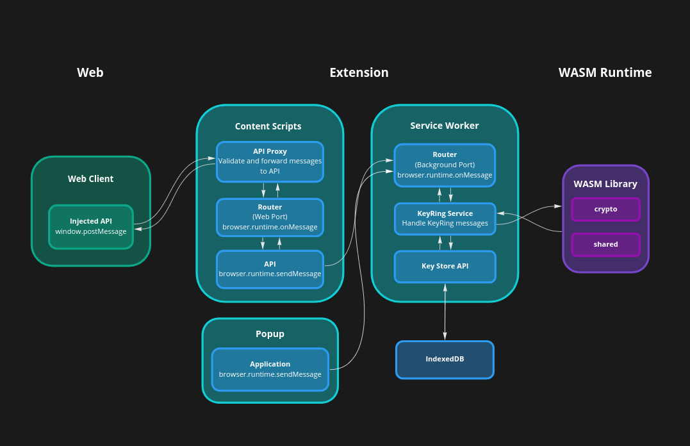

# Browser Extension - Architecture

The architecture of the extension and extension API somewhat resembles that of `@keplr-wallet/extension` in that it provides the following:

- A web client can connect to an API and issue commands
- The API calls are proxied to background services that handle storage
- The background services can handle authentication
- The background services can message the content scripts, which can push messages back to the client

There are a few key differences in functionality however. Our extension will only handle the creation of a seed and derived keypairs, as well as signing transactions.
It will not be responsible for allowing the user to send transfer transactions, but should be responsible for submitting account initialization transactions. The
web client will be able to request accounts from the extension, query balances on those extensions, and submit transactions (transparent, MASP, IBC, Ethereum Bridge), and will also
house any integrations with other wallets.

## Architecture

A high-level overview of this architecture should resemble the following:

_High-level overview of extension architecture_

The proxy is necessary to forward data via messages (using `window.postMessage`) to execute functions within the extension, as well as return message data to the client.

Essentially, any wasm- or storage-related functionality will be handled by the Service Worker (or background script in Firefox). This background process has access to IndexedDB,
and is configured in the manifest versions 2 and 3 to execute wasm code.

## Authentication

The extension has a simple authentication mechanism to give a user access to their seed and private keys. Currently, when the user enters a password, it is used to
decrypt their mnemonic, which, if successful, will set the password in the application's state until either the service worker shuts down, or the user locks the wallet.
This will be changed when issue [#199](https://github.com/anoma/namada-interface/issues/199) is implemented, which will instead decrypt a randomly generated value instead of
directly decrypting the mnemonic in order to verify the password and authenticate the user. This value will be generated when the user initializes the browser extension.

## Manifest considerations

Currently, Firefox does not support `manifest_version: 3`, but Chrome no longer accepts `manifest_version: 2` into their extension store. It is best that we follow what `metamask-extension`
is doing by supporting multiple both versions. `@keplr-wallet/extension` is currently using only version 2 in all browsers, but as this will be a new submission, we need to support version 3 for Chrome.

This has some implications for how the `background-scripts` are designed:

- As `manifest_version: 3` installs the `background-scripts` as a Service Worker, we no longer have any access to `window`. As such, we will need to code this with that in mind, which means
  we can't make any usage of the `window` API within both v2 and v3 manifests
- We should still be able to make use of the WebExtensions API via `browser` using `webextension-polyfill.js` within the service worker
- Any use of the `window` API will need to be handled either in the content scripts (where it is limited to the DOM, and does not contain other globals), or in the injected scripts (web client context)
- Sharing any state between the content scripts and the service worker requires use of the storage api (i.e., `browser.storage.local`)
